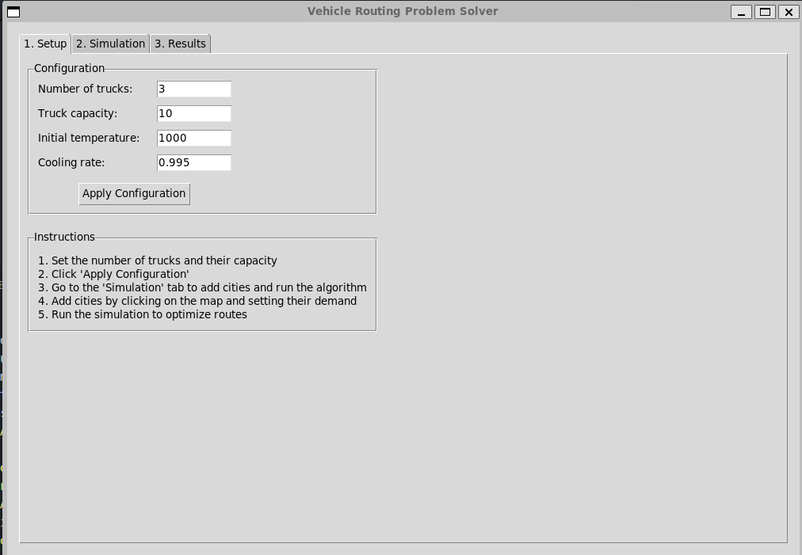
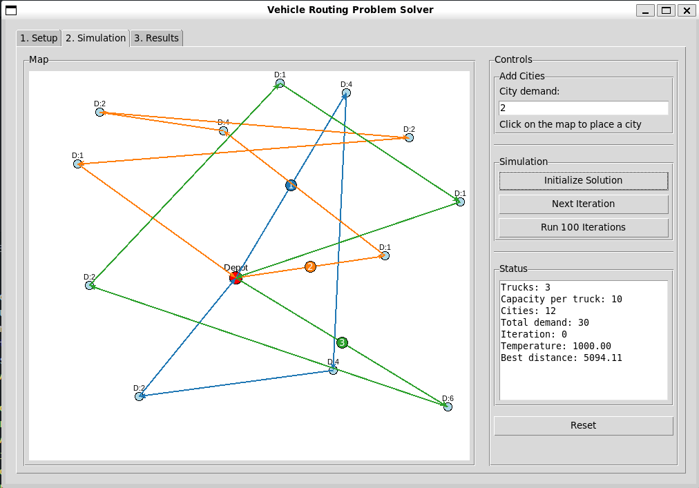
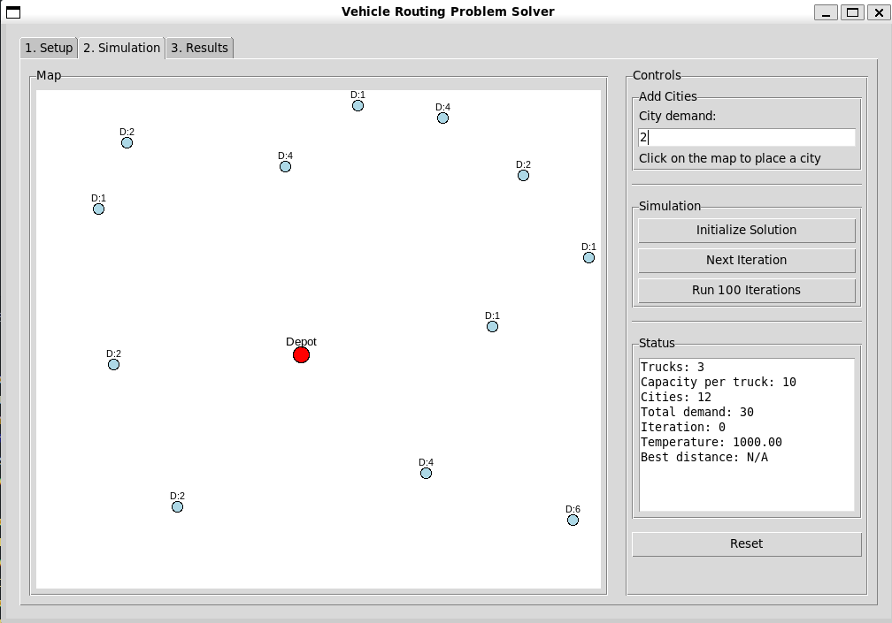
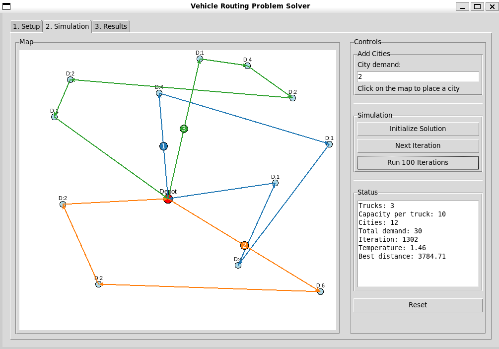
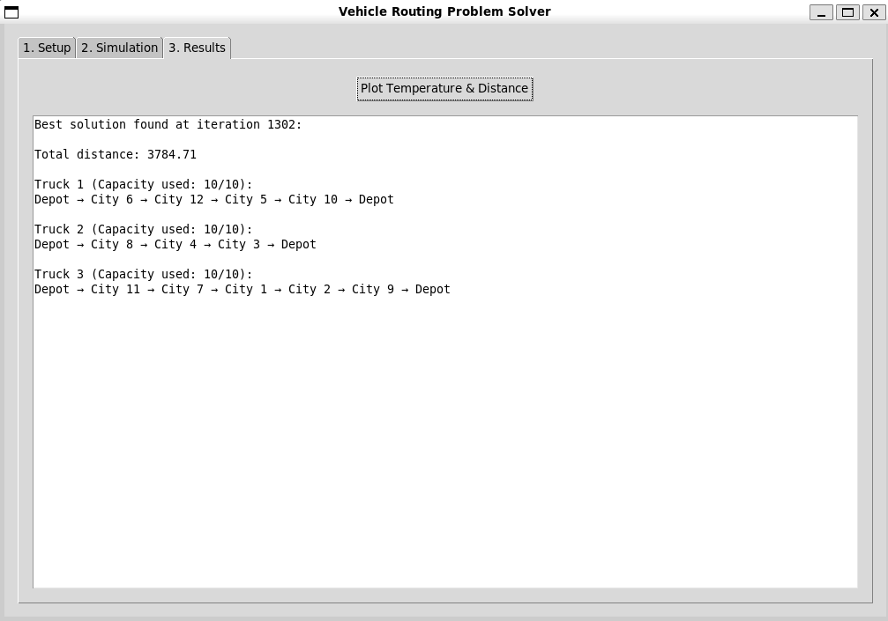
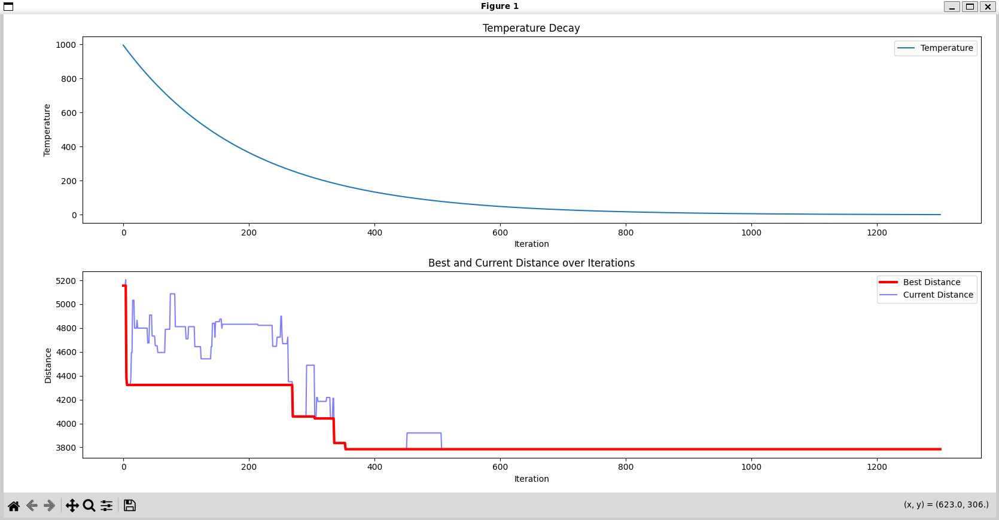

# VRP-Visualization

A visualization of a simulated annealing solution for the vehicle routing problem with capacity constraints.

## Project Overview

This project implements a simulated annealing algorithm to optimize delivery truck routes with the goal of minimizing total travel distance while adhering to truck capacity constraints. It was developed as part of an AI course assignment focused on solving the Vehicle Routing Problem (VRP).

## Features

- Interactive GUI for setting up and visualizing the VRP
- Customizable number of trucks and capacity constraints
- Adjustable simulated annealing parameters (initial temperature, cooling rate)
- Real-time visualization of route optimization
- Performance metrics tracking (temperature decay, distance optimization)

## Algorithm Implementation

The simulated annealing algorithm works as follows:

1. **Initial Solution:** Randomly assigns delivery points to trucks while respecting capacity constraints
2. **Neighbor Generation:** Creates new solutions by swapping cities between routes
3. **Acceptance Criteria:** Accepts better solutions automatically and worse solutions probabilistically based on temperature
4. **Cooling Schedule:** Temperature gradually decreases, reducing the probability of accepting worse solutions
5. **Iteration:** Process continues until a satisfactory solution is found or maximum iterations reached

## Code Structure

- `main.py` - Contains the complete implementation including:
  - `VRPApp` class: Main application class managing the GUI and algorithm
  - `calc_temp`: Temperature calculation function
  - Utility methods for distance calculation, solution generation and evaluation
  - GUI implementation with three tabs: Setup, Simulation, and Results

## User Interface

### Setup Screen

The setup screen allows configuring parameters like number of trucks, truck capacity, initial temperature, and cooling rate.

### Simulation Process
Initial solution with randomly assigned routes:

Simulation in progress:

Final optimized solution:

### Results Screen

The results screen shows the optimized routes and provides analysis of the algorithm's performance.

### Performance Metrics
The algorithm tracks temperature decay and distance optimization:

## How to Run

1. Ensure you have Python installed with the required packages (tkinter, matplotlib, numpy)
2. Run `python src/main.py`
3. Follow the three-step process in the GUI:
   - Configure parameters in the Setup tab
   - Add cities and run the simulation in the Simulation tab
   - View and analyze results in the Results tab
